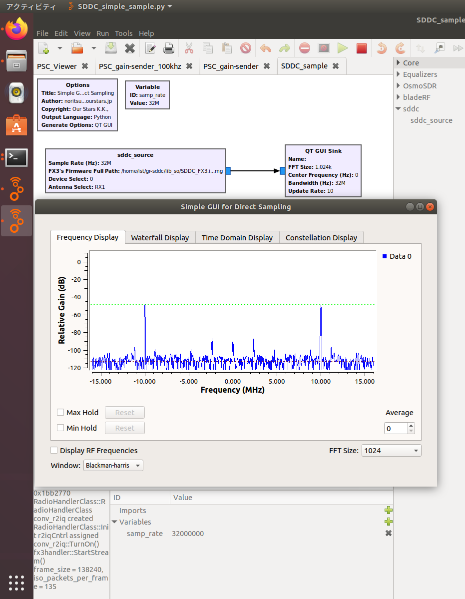

# GR-SDDC
The Direct Sampling SDR's GNURadio Module for SDDC(software digital down converter).
## Target Devices
- BBRF103
- HF103
- RX888
- RX888R2
- RX888R3
- RX999
- *** Supporting Direct Sampling Mode Only. ***

## Installation
First you need to install the dependencies (see below).

### Setup GNU Radio
These blocks require the GNU Radio 3.9.0.0 or new on Ubuntu 20.04.  

### Build GR-SDDC
Please build and setup GR-SDDC library to GNU Radio.  

    $ sudo apt-get install libusb-1.0-0-dev fftw-dev
    $ git clone https://github.com/ourstarsjp/gr-sddc.git
    $ cd gr-sddc
    $ sudo tar zxfv ./lib_so/libsddc.so.tar.gz -C /usr/lib/
    $ sudo ldconfig
    $ sudo cp ./lib_so/libsddc.h /usr/include/
    $ sudo cp ./lib_so/99-rf103.rules /etc/udev/rules.d/
    $ sudo udevadm control --reload-rules
    $ mkdir build
    $ cd build
    $ cmake ../
    $ sudo make install
    $ sudo ldconfig

## Dependencies
Required dependencies:

  * [libsddc](https://github.com/ik1xpv/ExtIO_sddc)
  * [libusb](https://libusb.info/)
  * [FFTW](https://www.fftw.org/)

### linux support of libsddc by vladisslav2011

  * [libsddc](https://github.com/vladisslav2011/ExtIO_sddc/tree/linux_fixes)
  * [gr-osmosdr](https://github.com/vladisslav2011/gr-osmosdr/tree/ngrx)

## Usage SDDC_source Block
1. Put sddc/SDDC_source Block & QT GUI Block on GNURadio Flow canbus.
1. Setup All Parameters of SDDC_source Block.
  1. Sample Rate (Hz) : Select this from 32M, 16M, 8M, 4M, 2M.
  1. firmware_path : SDDC_FX3.img's Full Path.
  1. device_select : The 1st device is "0".
  1. antenna : RX1 Only.
1. Setup a Sample Rate's Parameter of QT GUI Block.
  1. Sample Rate (Hz) : SDDC_source Block's Sample Rate.

  * [SDDC_simple_sample.grc](./examples/SDDC_simple_sample.grc)
